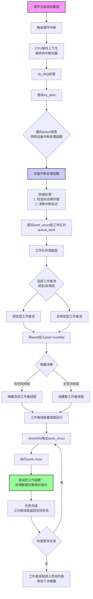

# Linux中断处理与工作队列机制全流程解析

## 📋 目录
1. [整体架构概览](#整体架构概览)
2. [第一阶段：硬件中断触发](#第一阶段硬件中断触发)
3. [第二阶段：中断上下文处理](#第二阶段中断上下文处理)
4. [第三阶段：工作队列提交](#第三阶段工作队列提交)
5. [第四阶段：工作队列调度](#第四阶段工作队列调度)
6. [第五阶段：线程池执行](#第五阶段线程池执行)
7. [完整流程图](#完整流程图)

---

## 整体架构概览

```
┌────────────────────────────────────────────────────────┐
│                   Linux中断与工作队列完整流程              │ 
├─────────────┬─────────────┬─────────────┬──────────────┤
│  硬件中断层  │  中断上下文  │  工作队列层  │  线程池执行层  │
│  Hardware   │  IRQ Context│  Workqueue  │  Thread Pool │
└─────────────┴─────────────┴─────────────┴──────────────┘
```

## 第一阶段：硬件中断触发

### 1.1 设备初始化注册

```c
// 1. 设备驱动初始化，分配设备结构
struct my_device {
    struct net_device *netdev;
    struct work_struct tx_work;      // 工作项
    struct workqueue_struct *wq;     // 工作队列
    void *rx_buffer;
    // ...
};

// 2. 注册中断处理函数（共享中断示例）
int my_driver_probe(struct pci_dev *pdev)
{
    struct my_device *dev = kzalloc(sizeof(*dev), GFP_KERNEL);
    
    // 初始化工作项
    INIT_WORK(&dev->tx_work, process_packets);
    
    // 创建工作队列
    dev->wq = alloc_workqueue("my_net_wq", 
                              WQ_UNBOUND | WQ_MEM_RECLAIM, 
                              1);
    
    // 注册中断处理函数（关键步骤！）
    ret = request_irq(pdev->irq,                // 中断号
                      my_interrupt_handler,     // 中断处理函数
                      IRQF_SHARED,              // 共享中断标志
                      "my_net_device",          // 设备名称
                      dev);                     // 设备私有数据
    
    return 0;
}
```

### 1.2 硬件中断触发

```c
// 硬件层面的事件链：
// 1. 网卡收到数据包 → DMA写入内存
// 2. 网卡设置中断状态寄存器
// 3. 网卡拉高中断线（IRQ引脚）
// 4. 中断控制器（如APIC）接收中断信号
// 5. 中断控制器向CPU发送中断向量
```

## 第二阶段：中断上下文处理

### 2.1 CPU响应中断

```c
// CPU硬件行为：
// 1. 保存当前上下文（寄存器值压栈）
// 2. 切换到内核态
// 3. 根据中断向量跳转到中断处理入口
// 4. 执行 do_IRQ() 函数

// arch/x86/kernel/irq.c
__visible unsigned int __irq_entry do_IRQ(struct pt_regs *regs)
{
    // 获取中断号
    unsigned int irq = regs->orig_ax & 0xff;
    
    // 进入通用中断处理
    irq_enter();
    generic_handle_irq(irq);
    irq_exit();
    
    return 1;
}
```

### 2.2 中断描述符查找与处理

```c
// generic_handle_irq() 的简化流程：
void generic_handle_irq(unsigned int irq)
{
    struct irq_desc *desc = irq_to_desc(irq);
    
    if (!desc)
        return;
    
    // 调用中断描述符的处理函数
    desc->handle_irq(desc);
}

// 对于共享中断，处理函数是 handle_irq_event()
irqreturn_t handle_irq_event(struct irq_desc *desc)
{
    struct irqaction *action;
    irqreturn_t ret = IRQ_NONE;
    
    // 遍历中断处理函数链表
    for (action = desc->action; action; action = action->next) {
        irqreturn_t res;
        
        // 调用设备特定的中断处理函数
        res = action->handler(action->irq, action->dev_id);
        
        if (res == IRQ_HANDLED)
            ret = IRQ_HANDLED;
    }
    
    return ret;
}
```

### 2.3 设备中断处理函数（中断上下文）

```c
// 设备驱动注册的中断处理函数
static irqreturn_t my_interrupt_handler(int irq, void *dev_id)
{
    struct my_device *dev = dev_id;
    
    // 1. 读取设备状态寄存器（判断是否自己的中断）
    u32 status = ioread32(dev->reg_base + STATUS_REG);
    
    if (!(status & RX_INTERRUPT)) {
        return IRQ_NONE;  // 不是自己的中断，快速返回
    }
    
    // 2. 清除中断标志（避免重复中断）
    iowrite32(status | CLEAR_INTERRUPT, dev->reg_base + STATUS_REG);
    
    // 3. 快速处理（在中断上下文中必须快速完成）
    //    - 更新统计信息
    //    - 禁用设备进一步中断（如果需要）
    
    // 4. 关键步骤：将耗时任务提交到工作队列
    //    不能在这里处理数据包，因为：
    //    a) 中断上下文不能睡眠
    //    b) 中断处理应该尽可能快
    //    c) 可能关闭了本地CPU中断
    
    queue_work(dev->wq, &dev->tx_work);
    
    // 5. 返回已处理标志
    return IRQ_HANDLED;
}
```

## 第三阶段：工作队列提交

### 3.1 `work_struct` 提交过程

```c
// queue_work() 的详细执行路径：
bool queue_work(struct workqueue_struct *wq, struct work_struct *work)
{
    return queue_work_on(WORK_CPU_UNBOUND, wq, work);
}

static bool __queue_work(int cpu, struct workqueue_struct *wq,
                        struct work_struct *work)
{
    struct pool_workqueue *pwq;
    struct worker_pool *pool;
    bool queued = false;
    
    // 1. 获取CPU锁，保护工作队列操作
    raw_spin_lock_irq(&pool->lock);
    
    // 2. 检查工作项是否已经在队列中
    if (!list_empty(&work->entry)) {
        raw_spin_unlock_irq(&pool->lock);
        return false;
    }
    
    // 3. 根据工作队列类型选择工作者池
    //    a) 绑定型工作队列：选择指定CPU的池
    //    b) 非绑定型工作队列：选择非绑定池
    pwq = get_work_pwq(wq, cpu);
    pool = pwq->pool;
    
    // 4. 将work_struct插入工作者池的待处理链表
    //    注意：添加到链表尾部（FIFO顺序）
    insert_work(pool, work, &pool->worklist, work_flags);
    
    // 5. 唤醒工作者线程
    //    这是关键唤醒点！
    if (need_to_create_worker(pool)) {
        // 如果线程不足，创建新线程
        create_worker(pool);
    } else if (need_to_wake_worker(pool)) {
        // 唤醒空闲的工作者线程
        struct worker *worker = first_idle_worker(pool);
        if (worker)
            wake_up_process(worker->task);
    }
    
    raw_spin_unlock_irq(&pool->lock);
    return true;
}

// insert_work() 实现
static void insert_work(struct worker_pool *pool,
                       struct work_struct *work,
                       struct list_head *head,
                       unsigned int extra_flags)
{
    // 将work_struct链接到工作者池的worklist链表
    list_add_tail(&work->entry, head);
    
    // 设置工作项的工作队列和标志
    set_work_pwq(work, pool, extra_flags);
}
```

## 第四阶段：工作队列调度

### 4.1 工作者池（`worker_pool`）管理

```c
// 工作者池数据结构（线程池的核心）
struct worker_pool {
    raw_spinlock_t lock;               // 保护池的锁
    
    // 线程管理
    int nr_workers;                    // 工作者线程总数
    int nr_idle;                       // 空闲线程数
    struct list_head idle_list;        // 空闲线程链表
    
    // 任务管理
    struct list_head worklist;         // 待处理任务链表（FIFO队列）
    
    // CPU关联
    int cpu;                           // 绑定的CPU（-1表示非绑定）
    
    // 动态调整
    struct timer_list idle_timer;      // 空闲超时计时器
    // ...
};
```

### 4.2 唤醒策略与负载均衡

```c
// need_to_wake_worker() 的决策逻辑
static bool need_to_wake_worker(struct worker_pool *pool)
{
    // 条件1：有任务等待处理
    if (list_empty(&pool->worklist))
        return false;
    
    // 条件2：有足够的工作量证明需要唤醒
    //        避免频繁唤醒带来的开销
    if (too_many_workers(pool))
        return false;
    
    // 条件3：考虑工作窃取（负载均衡）
    //        如果其他CPU的池很忙，本池可能不需要唤醒
    if (work_stealing_enabled && can_steal_work(pool))
        return false;
    
    return true;
}

// 工作者线程唤醒过程
static void wake_up_worker(struct worker_pool *pool)
{
    struct worker *worker;
    
    // 查找第一个空闲的工作者
    list_for_each_entry(worker, &pool->idle_list, entry) {
        if (worker->task->state == TASK_INTERRUPTIBLE) {
            // 执行真正的唤醒
            wake_up_process(worker->task);
            break;
        }
    }
}
```

## 第五阶段：线程池执行

### 5.1 工作者线程主循环

```c
// 工作者线程的核心函数
static int worker_thread(void *__worker)
{
    struct worker *worker = __worker;
    struct worker_pool *pool = worker->pool;
    
    // 设置线程名称（方便调试）
    set_task_comm(worker->task, "kworker/%s", pool->name);
    
    // 主循环
    while (!kthread_should_stop()) {
        struct work_struct *work = NULL;
        
        // 1. 准备执行任务
        worker_clr_flags(worker, WORKER_IDLE);
        
        // 2. 获取下一个任务
        raw_spin_lock_irq(&pool->lock);
        
        // 检查是否有待处理任务
        if (!list_empty(&pool->worklist)) {
            // 从链表头部获取任务（FIFO）
            work = list_first_entry(&pool->worklist,
                                   struct work_struct, entry);
            list_del_init(&work->entry);
        }
        
        // 3. 如果没有任务，进入空闲状态
        if (!work) {
            worker_set_flags(worker, WORKER_IDLE);
            list_add_tail(&worker->entry, &pool->idle_list);
            
            // 让出CPU，等待唤醒
            raw_spin_unlock_irq(&pool->lock);
            schedule();
            continue;
        }
        
        raw_spin_unlock_irq(&pool->lock);
        
        // 4. 执行任务（关键！）
        if (work) {
            process_one_work(worker, work);
        }
    }
    
    return 0;
}
```

### 5.2 任务执行过程

```c
// 执行单个工作项
static void process_one_work(struct worker *worker,
                            struct work_struct *work)
{
    struct pool_workqueue *pwq = get_work_pwq(work);
    
    // 1. 设置工作者状态
    worker->current_work = work;
    worker->current_pwq = pwq;
    
    // 2. 执行工作函数（这是驱动注册的函数！）
    //    注意：此时在进程上下文，可以睡眠、调度等
    work->func(work);
    
    // 3. 清理状态
    worker->current_work = NULL;
    worker->current_pwq = NULL;
    
    // 4. 检查是否需要唤醒其他工作者
    //    如果还有待处理任务，可能唤醒其他线程
    if (atomic_dec_and_test(&pwq->nr_active) &&
        !list_empty(&pool->worklist)) {
        wake_up_worker(pool);
    }
}
```

### 5.3 设备工作函数执行

```c
// 回到设备驱动：之前注册的工作函数
static void process_packets(struct work_struct *work)
{
    // 从work_struct获取设备结构
    struct my_device *dev = container_of(work,
                                        struct my_device,
                                        tx_work);
    
    // 此时在进程上下文，可以：
    // 1. 睡眠等待资源
    // 2. 进行内存分配（GFP_KERNEL）
    // 3. 访问用户空间
    // 4. 执行长时间操作
    
    // 处理数据包
    while (has_packets(dev)) {
        struct sk_buff *skb = get_next_packet(dev);
        
        // 网络协议栈处理
        netif_receive_skb(skb);
        
        // 更新统计
        dev->stats.rx_packets++;
        dev->stats.rx_bytes += skb->len;
    }
    
    // 重新使能设备中断（如果在中断处理中禁用了）
    enable_device_interrupts(dev);
}
```

## 完整流程图


